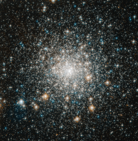

# Preview of potw1215a: "Tight and bright"
[https://www.spacetelescope.org/images/potw1215a/](https://www.spacetelescope.org/images/potw1215a/)

In this image, the NASA/ESA Hubble Space Telescope has captured the brilliance of the compact centre of Messier 70, a globular cluster. Quarters are always tight in globular clusters, where the mutual hold of gravity binds together hundreds of thousands of stars in a small region of space. Having this many shining stars piled on top of one another from our perspective makes globular clusters a popular target for amateur skywatchers and scientists alike. Messier 70 offers a special case because it has undergone what is known as a core collapse. In these clusters, even more stars squeeze into the object's core than on average, such that the brightness of the cluster increases steadily towards its centre. The legions of stars in a globular cluster orbit about a shared centre of gravity. Some stars maintain relatively circular orbits, while others loop out into the cluster's fringes. As the stars interact with each other over time, lighter stars tend to pick up speed and migrate out toward the cluster's edges, while the heavier stars slow and congregate in orbits toward the centre. This huddling effect produces the denser, brighter centres characteristic of core-collapsed clusters. About a fifth of the more than 150 globular clusters in the Milky Way have undergone a core collapse. Although many globular clusters call the galaxy's edges home, Messier 70 orbits close to the Milky Way's centre, around 30 000 light-years away from the Solar System. It is remarkable that Messier 70 has held together so well, given the strong gravitational pull of the Milky Way's hub. Messier 70 is only about 68 light-years in diameter and can be seen, albeit very faintly, with binoculars in dark skies in the constellation of Sagittarius (The Archer). French astronomer Charles Messier documented the object in 1780 as the seventieth entry in his famous astronomical catalogue. This picture was obtained with the Wide Field Camera of Hubble’s Advanced Camera for Surveys. The field of view is around 3.3 by 3.3 arcminutes.