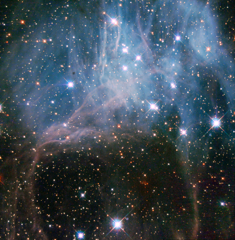

# Preview of potw1216a: "Hubble peeks inside a stellar cloud"
[https://www.spacetelescope.org/images/potw1216a/](https://www.spacetelescope.org/images/potw1216a/)

These bright stars shining through what looks like a haze in the night sky are part of a young stellar grouping in one of the largest known star formation regions of the Large Magellanic Cloud (LMC), a dwarf satellite galaxy of the Milky Way. The image was captured by the NASA/ESA Hubble Space Telescope’s Wide Field Planetary Camera 2. The stellar grouping is known to stargazers as NGC 2040 or LH 88. It is essentially a very loose star cluster whose stars have a common origin and are drifting together through space. There are three different types of stellar associations defined by their stellar properties. NGC 2040 is an OB association, a grouping that usually contains 10–100 stars of type O and B — these are high-mass stars that have short but brilliant lives. It is thought that most of the stars in the Milky Way were born in OB associations. There are several such groupings of stars in the LMC, including one previously featured as a Hubble Picture of the Week. Just like the others, LH 88 consists of several high-mass young stars in a large nebula of partially ionised hydrogen gas, and lies in what is known to be a supergiant shell of gas called LMC 4. Over a period of several million years, thousands of stars may form in these supergiant shells, which are the largest interstellar structures in galaxies. The shells themselves are believed to have been created by strong stellar winds and clustered supernova explosions of massive stars that blow away surrounding dust and gas, and in turn trigger further episodes of star formation. The LMC is the third closest galaxy to our Milky Way. It is located some 160 000 light-years away, and is about 100 times smaller than our own. This image, which shows ultraviolet, visible and infrared light, covers a field of view of approximately 1.8 by 1.8 arcminutes. A version of this image was entered into the Hubble’s Hidden Treasures Image Processing Competition by contestant Eedresha Sturdivant. Hidden Treasures is an initiative to invite astronomy enthusiasts to search the Hubble archive for stunning images that have never been seen by the general public.