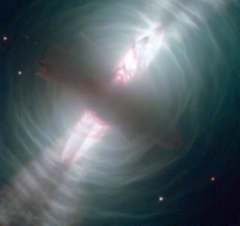

# Preview of potw1217a: "Hubble images searchlight beams from a preplanetary nebula"
[https://www.spacetelescope.org/images/potw1217a/](https://www.spacetelescope.org/images/potw1217a/)

The NASA/ESA Hubble Space Telescope has been at the cutting edge of research into what happens to stars like our Sun at the ends of their lives (see for example Hubblecast 51). One stage that stars pass through as they run out of nuclear fuel is the preplanetary, or protoplanetary nebula. This Hubble image of the Egg Nebula shows one of the best views to date of this brief but dramatic phase in a star’s life. The preplanetary nebula phase is a short period in the cycle of stellar evolution — over a few thousand years, the hot remains of the star in the centre of the nebula heat it up, excite the gas, and make it glow as a planetary nebula. The short lifespan of preplanetary nebulae means there are relatively few of them in existence at any one time. Moreover, they are very dim, requiring powerful telescopes to be seen. This combination of rarity and faintness means they were only discovered comparatively recently. The Egg Nebula, the first to be discovered, was first spotted less than 40 years ago, and many aspects of this class of object remain shrouded in mystery. At the centre of this image, and hidden in a thick cloud of dust, is the nebula’s central star. While we can’t see the star directly, four searchlight beams of light coming from it shine out through the nebula. It is thought that ring-shaped holes in the thick cocoon of dust, carved by jets coming from the star, let the beams of light emerge through the otherwise opaque cloud. The precise mechanism by which stellar jets produce these holes is not known for certain, but one possible explanation is that a binary star system, rather than a single star, exists at the centre of the nebula. The onion-like layered structure of the more diffuse cloud surrounding the central cocoon is caused by periodic bursts of material being ejected from the dying star. The bursts typically occur every few hundred years. The distance to the Egg Nebula is only known very approximately, the best guess placing it at around 3000 light-years from Earth. This in turn means that astronomers do not have any accurate figures for the size of the nebula (it may be larger and further away, or smaller but nearer). This image is produced from exposures in visible and infrared light from Hubble’s Wide Field Camera 3.