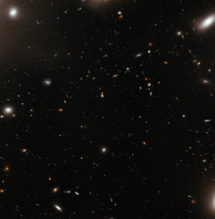

# Preview of potw1218a: "The eye of the storm"
[https://www.spacetelescope.org/images/potw1218a/](https://www.spacetelescope.org/images/potw1218a/)

This image from the NASA/ESA Hubble Space Telescope could seem like a quiet patch of sky at first glance. But zooming into the central part of a galaxy cluster — one of the largest structures of the Universe — is rather like looking at the eye of the storm. Clusters of galaxies are large groups consisting of dozens to hundreds of galaxies, which are bound together by gravity. The galaxies sometimes stray too close to one another and the huge gravitational forces at play can distort them or even rip matter off when they collide with one another. This particular cluster, called Abell 1185, is a chaotic one. Galaxies of various shapes and sizes are drifting dangerously close to one another. Some have already been ripped apart in this cosmic maelstrom, shedding trails of matter into the void following their close encounter. They have formed a familiar shape called The Guitar, located just outside the frame of this image. Abell 1185 is located approximately 400 million light-years away from Earth and spans one million light-years across. A few of the elliptical galaxies that form the cluster are visible in the corners of this image, but mostly, the small elliptical shapes seen are faraway galaxies in the background, located much further away, in a quieter area of the Universe.