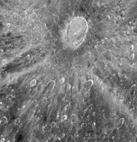

# Preview of potw1219a: "Using the Moon as a mirror — Hubble to watch transit of Venus in reflected light"
[https://www.spacetelescope.org/images/potw1219a/](https://www.spacetelescope.org/images/potw1219a/)

This mottled landscape showing the impact crater Tycho is among the most violent-looking places on our Moon. But astronomers didn’t aim the NASA/ESA Hubble Space Telescope in this direction to study Tycho itself. The image was taken in preparation for the transit of Venus across the Sun’s face on on 5-6 June 2012. Hubble cannot look at the Sun directly, so astronomers are planning to point the telescope at Earth’s Moon and use it as a mirror to capture reflected sunlight. During the transit a small fraction of that light will have passed through Venus’s atmosphere and imprinted on that light astronomers expect to find the fingerprints of the planet’s atmospheric makeup. These observations will mimic a technique that is already being used to sample the atmospheres of giant planets outside our Solar System passing in front of their stars. In the case of the Venus transit observations, astronomers already know the chemical makeup of Venus’s atmosphere, and that it shows no signs of life. But they can use the event to test whether their technique has a chance of detecting the very faint fingerprints of the atmosphere of an Earth-like planet around another star. This image shows an area approximately 700 kilometres across, and reveals lunar features as small as roughly 170 metres across. The large bullseye near the top of the picture is the impact crater itself, caused by an asteroid strike about 100 million years ago. The bright trail radiating from the crater were formed by material ejected from the impact area during the asteroid collision. Tycho is about 80 kilometers wide and is circled by a rim of material rising almost 5 kilometers above the crater floor. Because the astronomers only have one shot at observing the transit, they had to carefully plan how the study would be carried out. Part of their planning included these test observations of the Moon made on 11 January 2012. This is the last time this century sky watchers can view Venus passing in front of the Sun, as the next transit will not happen until 2117. The image was produced by Hubble’s Advanced Camera for Surveys. A narrow strip along the centre, and small parts of the upper left part of the image were not imaged by Hubble during its observations, and show data from lower-resolution observations made by a ground-based telescope.