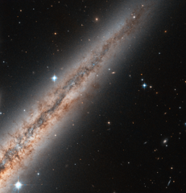

# Preview of potw1220a: "Edge-on beauty"
[https://www.spacetelescope.org/images/potw1220a/](https://www.spacetelescope.org/images/potw1220a/)

Visible  in the constellation of Andromeda, NGC 891 is located approximately 30  million light-years away from Earth. The NASA/ESA Hubble Space Telescope  turned its powerful wide field Advanced Camera for Surveys towards this  spiral galaxy and took this close-up of its northern half. The galaxy's  central bulge is just out of the image on the bottom left. The  galaxy, spanning some 100 000 light-years, is seen exactly edge-on, and  reveals its thick plane of dust and interstellar gas. While initially  thought to look like our own Milky Way if seen from the side, more  detailed surveys revealed the existence of filaments of dust and gas  escaping the plane of the galaxy into the halo over hundreds of  light-years. They can be clearly seen here against the bright background  of the galaxy halo, expanding into space from the disc of the galaxy. Astronomers  believe these filaments to be the result of the ejection of material  due to supernovae or intense stellar formation activity. By lighting up  when they are born, or exploding when they die, stars cause powerful  winds that can blow dust and gas over hundreds of light-years in space. A  few foreground stars from the Milky Way shine brightly in the image,  while distant elliptical galaxies can be seen in the lower right of the  image. NGC 891 is part of a small group of galaxies bound together by gravity.  A version of this image was entered into the Hubble’s Hidden Treasures Image Processing Competition by contestant Nick Rose. Hidden Treasures is an initiative to  invite astronomy enthusiasts to search the Hubble archive for stunning  images that have never been seen by the general public.