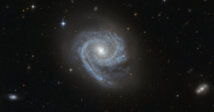

# Preview of potw1221a: "A spiral within a spiral"
[https://www.spacetelescope.org/images/potw1221a/](https://www.spacetelescope.org/images/potw1221a/)

The NASA/ESA Hubble Space Telescope captured this image of the spiral galaxy known as ESO 498-G5. One interesting feature of this galaxy is that its spiral arms wind all the way into the centre, so that ESO 498-G5's core looks like a bit like a miniature spiral galaxy. This sort of structure is in contrast to the elliptical star-filled centres (or bulges) of many other spiral galaxies, which instead appear as glowing masses, as in the case of NGC 6384. Astronomers refer to the distinctive spiral-like bulge of galaxies such as ESO 498-G5 as disc-type bulges, or pseudobulges, while bright elliptical centres are called classical bulges. Observations from the Hubble Space Telescope, which does not have to contend with the distorting effects of Earth's atmosphere, have helped to reveal that these two different types of galactic centres exist. These observations have also shown that star formation is still going on in disc-type bulges and has ceased in classical bulges. This means that galaxies can be a bit like Russian matryoshka dolls: classical bulges look much like a miniature version of an elliptical galaxy, embedded in the centre of a spiral, while disc-type bulges look like a second, smaller spiral galaxy located at the heart of the first — a spiral within a spiral. The similarities between types of galaxy bulge and types of galaxy go beyond their appearance. Just like giant elliptical galaxies, the classical bulges consist of great swarms of stars moving about in random orbits. Conversely, the structure and movement of stars within disc-type bulges mirror the spiral arms arrayed in a galaxy's disc. These differences suggest different origins for the two types of bulges: while classical bulges are thought to develop through major events, such as mergers with other galaxies, disc-type bulges evolve gradually, developing their spiral pattern as stars and gas migrate to the galaxy’s centre. ESO 498-G5 is located around 100 million light-years away in the constellation of Pyxis (The Compass). This image is made up of exposures in visible and infrared light taken by Hubble’s Advanced Camera for Surveys. The field of view is approximately 3.3 by 1.6 arcminutes.