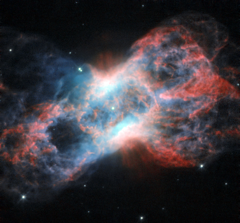

# Preview of potw1222a: "The swan and the butterfly"
[https://www.spacetelescope.org/images/potw1222a/](https://www.spacetelescope.org/images/potw1222a/)

This image from the NASA/ESA Hubble Space Telescope shows NGC 7026, a planetary nebula. Located just beyond the tip of the tail of the constellation of Cygnus (The Swan), this butterfly-shaped cloud of glowing gas and dust is the wreckage of a star similar to the Sun. Planetary nebulae, despite their name, have nothing to do with planets. They are in fact a relatively short-lived phenomenon that occurs at the end of the life of mid-sized stars. As a star’s source of nuclear fuel runs out, its outer layers are puffed out, leaving only the hot core of the star behind. As the gaseous envelope heats up, the atoms in it are excited, and it lights up like a fluorescent sign. Fluorescent lights on Earth get their bright colours from the gases they are filled with. Neon signs, famously, produce a bright red colour, while ultraviolet lights (black lights) typically contain mercury. The same goes for nebulae: their vivid colours are produced by the mix of gases present in them. This image of NGC 7026 shows starlight in green, light from glowing nitrogen gas in red, and light from oxygen in blue (in reality, this appears green, but the colour in this image has been shifted to increase the contrast). As well as visible light, NGC 7026 emits X-ray radiation, and has been studied by ESA’s XMM-Newton space telescope. X-rays are a result of the extremely high temperatures of the gas in NGC 7026. This image was produced by the Wide Field and Planetary Camera 2 aboard the Hubble Space Telescope. The image is 35 by 35 arcseconds. A version of this image was entered into the Hubble’s Hidden Treasures Competition by contestant Linda Morgan-O'Connor. Hidden Treasures is an initiative to invite astronomy enthusiasts to search the Hubble archive for stunning images that have never been seen by the general public.