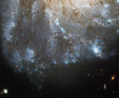

# Preview of potw1223a: "A bright spark in a nearby spiral galaxy"
[https://www.spacetelescope.org/images/potw1223a/](https://www.spacetelescope.org/images/potw1223a/)

This image, taken by the NASA/ESA Hubble Space Telescope, shows a detailed view of the spiral arms on one side of the galaxy Messier 99. Messier 99 is a so-called grand design spiral, with long, large and clearly defined spiral arms — giving it a structure somewhat similar to the Milky Way. Lying around 50 million light-years away, Messier 99 is one of over a thousand galaxies that make up the Virgo Cluster, the closest cluster of galaxies to us. Messier 99 itself is relatively bright and large, meaning it was one of the first galaxies to be discovered, way back in the 18th century. This earned it a place in Charles Messier’s famous catalogue of astronomical objects. In recent years, a number of unexplained phenomena in Messier 99 have been studied by astronomers. Among these is the nature of one of the brighter stars visible in this image. Catalogued as PTF 10fqs, and visible as a yellow-orange star in the top-left corner of this image, it was first spotted by the Palomar Transient Facility, which scans the skies for sudden changes in brightness (or transient phenomena, to use astronomers’ jargon). These can be caused by different kinds of event, including variable stars and supernova explosions. What is unusual about PTF 10fqs is that it has so far defied classification: it is brighter than a nova (a bright eruption on a star’s surface), but fainter than a supernova (the explosion that marks the end of life for a large star). Scientists have offered a number of possible explanations, including the intriguing suggestion that it could have been caused by a giant planet plunging into its parent  star. This Hubble image was made in June 2010, during the period when the outburst was fading, so PTF 10fqs’s location could be pinpointed with great precision. These measurements will allow other telescopes to home in on the star in future, even when the afterglow of the outburst has faded to nothing. A version of this image of M 99 was entered into the Hubble’s Hidden Treasures Competition by contestant Matej Novak. Hidden Treasures is an initiative to invite astronomy enthusiasts to search the Hubble archive for stunning images that have never been seen by the general public. The competition is now closed and the winners will be announced soon.