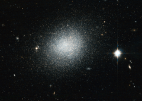

# Preview of potw1224a: "Compact blue dwarf can’t hide"
[https://www.spacetelescope.org/images/potw1224a/](https://www.spacetelescope.org/images/potw1224a/)

The NASA/ESA Hubble Space Telescope has captured this view of the dwarf galaxy UGC 5497, which looks a bit like salt dashed on black velvet in this image. The object is a compact blue dwarf galaxy that is infused with newly formed clusters of stars. The bright, blue stars that arise in these clusters help to give the galaxy an overall bluish appearance that lasts for several million years until these fast-burning stars explode as supernovae. UGC 5497 is considered part of the M 81 group of galaxies, which is located about 12 million light-years away in the constellation Ursa Major (The Great Bear). UGC 5497 turned up in a ground-based telescope survey back in 2008 looking for new dwarf galaxy candidates associated with Messier 81. According to the leading cosmological theory of galaxy formation, called Lambda Cold Dark Matter, there should be far more satellite dwarf galaxies associated with big galaxies like the Milky Way and Messier 81 than are currently known. Finding previously overlooked objects such as this one has helped cut into the expected tally — but only by a small amount. Astrophysicists therefore remain puzzled over the so-called "missing satellite" problem. The field of view in this image, which is a combination of visible and infrared exposures from Hubble’s Advanced Camera for Surveys, is approximately 3.4 by 3.4 arcminutes.