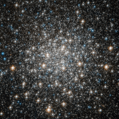

# Preview of potw1225a: "Globular cluster M 10"
[https://www.spacetelescope.org/images/potw1225a/](https://www.spacetelescope.org/images/potw1225a/)

Like many of the most famous objects in the sky, globular cluster Messier 10 was of little interest to its discoverer: Charles Messier, the 18th century French astronomer, catalogued over 100 galaxies and clusters, but was primarily interested in comets. Through the telescopes available at the time, comets, nebulae, globular clusters and galaxies appeared just as faint, diffuse blobs and could easily be confused for one another. Only by carefully observing their motion — or lack of it — were astronomers able to distinguish them: comets move slowly relative to the stars in the background, while other more distant astronomical objects do not move at all. Messier’s decision to catalogue all the objects that he could find and that were not comets, was a pragmatic solution which would have a huge impact on astronomy. His catalogue of just over 100 objects includes many of the most famous objects in the night sky. Messier 10, seen here in an image from the NASA/ESA Hubble Space Telescope, is one of them. Messier described it in the very first edition of his catalogue, which was published in 1774 and included the first 45 objects he identified. Messier 10 is a ball of stars that lies about 15 000 light-years from Earth, in the constellation of Ophiuchus (The Serpent Bearer). Approximately 80 light-years across, it should therefore appear about two thirds the size of the Moon in the night sky. However, its outer regions are extremely diffuse, and even the comparatively bright core is too dim to see with the naked eye. Hubble, which has no problems seeing faint objects, has observed the brightest part of the centre of the cluster in this image, a region which is about 13 light-years across. This image is made up of observations made in visible and infrared light using Hubble’s Advanced Camera for Surveys. The observations were carried out as part of a major Hubble survey of globular clusters in the Milky Way. A version of this image was entered into the Hubble’s Hidden Treasures Image Processing Competition by contestant flashenthunder. Hidden Treasures is an initiative to invite astronomy enthusiasts to search the Hubble archive for stunning images that have never been seen by the general public. The competition has now closed and the results will be published soon. 