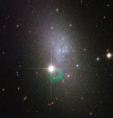

# Preview of potw1226a: "A vapour of stars"
[https://www.spacetelescope.org/images/potw1226a/](https://www.spacetelescope.org/images/potw1226a/)

Relatively few galaxies possess the sweeping, luminous spiral arms or brightly glowing centre of our home galaxy the Milky Way. In fact, most of the Universe's galaxies look like small, amorphous clouds of vapour. One of these galaxies is DDO 82, captured here in an image from the NASA/ESA Hubble Space Telescope. Though tiny compared to the Milky Way, such dwarf galaxies still contain between a few million and a few billion stars. DDO 82, also known by the designation UGC 5692, is not without a hint of structure, however. Astronomers classify it as an Sm galaxy, or Magellanic spiral galaxy, named after the Large Magellanic Cloud, a dwarf galaxy that orbits the Milky Way. That galaxy, like DDO 82, is said to have one spiral arm. In the case of DDO 82, gravitational interactions over its history seem to have discombobulated it so that this structure is not as evident as in the Large Magellanic Cloud. Accordingly, astronomers also refer to DDO 82 and others of a similar unshapely nature as dwarf irregular galaxies.        DDO 82 can be found in the constellation of Ursa Major (the Great Bear) approximately 13 million light-years away. The object is considered part of the M81 Group of around three dozen galaxies. DDO 82 gets its name from its entry number in the David Dunlap Observatory Catalogue. Canadian astronomer Sidney van den Bergh originally compiled this list of dwarf galaxies in 1959. The image is made up of exposures taken in visible and infrared light by Hubble’s Advanced Camera for Surveys. The field of view is approximately 3.3 by 3.3 arcminutes.