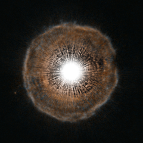

# Preview of potw1227a: "Red giant blows a bubble"
[https://www.spacetelescope.org/images/potw1227a/](https://www.spacetelescope.org/images/potw1227a/)

A bright star is surrounded by a tenuous shell of gas in this unusual image from the NASA/ESA Hubble Space Telescope. U Camelopardalis, or U Cam for short, is a star nearing the end of its life. As it begins to run low on fuel, it is becoming unstable. Every few thousand years, it coughs out a nearly spherical shell of gas as a layer of helium around its core begins to fuse. The gas ejected in the star’s latest eruption is clearly visible in this picture as a faint bubble of gas surrounding the star. U Cam is an example of a carbon star. This is a rare type of star whose atmosphere contains more carbon than oxygen. Due to its low surface gravity, typically as much as half of the total mass of a carbon star may be lost by way of powerful stellar winds. Located in the constellation of Camelopardalis (The Giraffe), near the North Celestial Pole, U Cam itself is actually much smaller than it appears in Hubble’s picture. In fact, the star would easily fit within a single pixel at the centre of the image. Its brightness, however, is enough to overwhelm the capability of Hubble’s Advanced Camera for Surveys making the star look much bigger than it really is. The shell of gas, which is both much larger and much fainter than its parent star, is visible in intricate detail in Hubble’s portrait. While phenomena that occur at the ends of stars’ lives are often quite irregular and unstable (see for example Hubble’s images of Eta Carinae, potw1208a), the shell of gas expelled from U Cam is almost perfectly spherical. The image was produced with the High Resolution Channel of the Advanced Camera for Surveys.