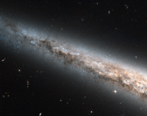

# Preview of potw1228a: "A galactic disc, edge-on and up close"
[https://www.spacetelescope.org/images/potw1228a/](https://www.spacetelescope.org/images/potw1228a/)

This image snapped by the NASA/ESA Hubble Space Telescope reveals an exquisitely detailed view of part of the disc of the spiral galaxy NGC 4565. This bright galaxy is one of the most famous examples of an edge-on spiral galaxy, oriented perpendicularly to our line of sight so that we see right into its luminous disc. NGC 4565 has been nicknamed the Needle Galaxy because, when seen in full, it appears as a very narrow streak of light on the sky. The edgewise view into the Needle Galaxy shown here looks very similar to the view we have from our Solar System into the core of the Milky Way. In both cases ribbons of dust block some of the light coming from the galactic disc. To the lower right, the dust stands in even starker contrast against the copious yellow light from the star-filled central regions. NGC 4565’s core is off camera to the lower right. For a full view of NGC 4565 for comparison’s sake, see this wider field of view from ESO’s Very Large Telescope. Studying galaxies like NGC 4565 helps astronomers learn more about our home, the Milky Way. At a distance of only about 40 million light-years, NGC 4565 is relatively close by, and being seen edge-on makes it a particularly useful object for comparative study. As spiral galaxies go, NGC 4565 is a whopper — about a third as big again as the Milky Way. The image was taken with Hubble’s Advanced Camera for Surveys and has a field of view of approximately 3.4 by 3.4 arcminutes. A version of this image was entered into the Hubble’s Hidden Treasures Image Processing Competition by  contestant Josh Barrington. Hidden Treasures is an initiative to invite  astronomy enthusiasts to search the Hubble archive for stunning images  that have never been seen by the general public. The competition has now  closed and the results will be published soon.