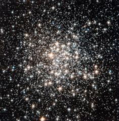

# Preview of potw1229a: "An audience of stellar flashbulbs"
[https://www.spacetelescope.org/images/potw1229a/](https://www.spacetelescope.org/images/potw1229a/)

The NASA/ESA Hubble Space Telescope has captured a crowd of stars that looks rather like a stadium darkened before a show, lit only by the flashbulbs of the audience’s cameras. Yet the many stars of this object, known as Messier 107, are not a fleeting phenomenon, at least by human reckoning of time — these ancient stars have gleamed for many billions of years. Messier 107 is one of more than 150 globular star clusters found around the disc of the Milky Way galaxy. These spherical collections each contain hundreds of thousands of extremely old stars and are among the oldest objects in the Milky Way. The origin of globular clusters and their impact on galactic evolution remains somewhat unclear, so astronomers continue to study them through pictures such as this one obtained by Hubble. As globular clusters go, Messier 107 is not particularly dense. Visually comparing its appearance to other globular clusters, such as Messier 53 or Messier 54 reveals that the stars within Messier 107 are not packed as tightly, thereby making its members more distinct like individual fans in a stadium's stands. Messier 107 can be found in the constellation of Ophiuchus (The Serpent Bearer) and is located about 20 000 light-years from the Solar System. French astronomer Pierre Méchain first noted the object in 1782, and British astronomer William Herschel documented it independently a year later. A Canadian astronomer, Helen Sawyer Hogg, added Messier 107 to Charles Messier's famous astronomical catalogue in 1947. This picture was obtained with the Wide Field Camera of Hubble’s Advanced Camera for Surveys. The field of view is approximately 3.4 by 3.4 arcminutes.