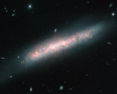

# Preview of potw1230a: "A galaxy festooned with stellar nurseries"
[https://www.spacetelescope.org/images/potw1230a/](https://www.spacetelescope.org/images/potw1230a/)

The  galaxy NGC 4700 bears the signs of the vigorous birth of many new stars  in this image captured by the NASA/ESA Hubble Space Telescope. The  many bright, pinkish clouds in NGC 4700 are known as H II regions,  where intense ultraviolet light from hot young stars is causing nearby  hydrogen gas to glow. H II regions often come part-and-parcel with the  vast molecular clouds that spawn fresh stars, thus giving rise to the  locally ionised gas. In  1610, French astronomer Nicolas-Claude Fabri de Peiresc peered through a  telescope and found what turned out to be the first H II region on  record: the Orion Nebula, located relatively close to our Solar System  here in the Milky Way. Astronomers study these regions throughout the  Milky Way and those easily seen in other galaxies to gauge the chemical  makeup of cosmic environments and their influence on the formation of  stars. NGC  4700 was discovered back in March 1786 by the British astronomer  William Herschel who noted it as a “very faint nebula”. NGC 4700, along  with many other relatively close galaxies, is found in the constellation  of Virgo (The Virgin) and is classified as a barred spiral galaxy,  similar in structure to the Milky Way. It lies about 50 million  light-years from us and is moving away from us at about 1400 km/second  due to the expansion of the Universe.