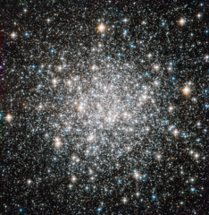

# Preview of potw1231a: "A ten billion year stellar dance"
[https://www.spacetelescope.org/images/potw1231a/](https://www.spacetelescope.org/images/potw1231a/)

The NASA/ESA Hubble Space Telescope offers this delightful view of the crowded stellar encampment called Messier 68, a spherical, star-filled region of space known as a globular cluster. Mutual gravitational attraction amongst a cluster’s hundreds of thousands or even millions of stars keeps stellar members in check, allowing globular clusters to hang together for many billions of years. Astronomers can measure the ages of globular clusters by looking at the light of their constituent stars. The chemical elements leave signatures in this light, and the starlight reveals that globular clusters' stars typically contain fewer heavy elements, such as carbon, oxygen and iron, than stars like the Sun. Since successive generations of stars gradually create these elements through nuclear fusion, stars having fewer of them are relics of earlier epochs in the Universe. Indeed, the stars in globular clusters rank among the oldest on record, dating back more than 10 billion years. More than 150 of these objects surround our Milky Way galaxy. On a galactic scale, globular clusters are indeed not all that big. In Messier 68's case, its constituent stars span a volume of space with a diameter of little more than a hundred light-years. The disc of the Milky Way, on the other hand, extends over some 100 000 light-years or more. Messier 68 is located about 33 000 light-years from Earth in the constellation Hydra (The Female Water Snake). French astronomer Charles Messier notched the object as the sixty-eighth entry in his famous catalogue in 1780. Hubble added Messier 68 to its own impressive list of cosmic targets in this image using the Wide Field Camera of Hubble’s Advanced Camera for Surveys. The image, which combines visible and infrared light, has a field of view of approximately 3.4 by 3.4 arcminutes.