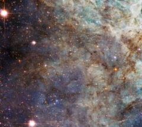

# Preview of potw1232a: "Close encounter with the Tarantula"
[https://www.spacetelescope.org/images/potw1232a/](https://www.spacetelescope.org/images/potw1232a/)

Turning its 2.4-metre eye to the Tarantula Nebula, the NASA/ESA Hubble Space Telescope has taken this close-up of the outskirts of the main cloud of the Nebula. The bright wispy structures are the signature of an environment rich in ionised hydrogen gas, called H II by astronomers. In reality these appear red, but the choice of filters and colours of this image, which includes exposures both in visible and infrared light, make the gas appear green. These regions contain recently formed stars, which emit powerful ultraviolet radiation that ionises the gas around them. These clouds are ephemeral as eventually the stellar winds from the newborn stars and the ionisation process will blow away the clouds, leaving stellar clusters like the Pleiades. Located in the Large Magellanic Cloud, one of our neighbouring galaxies, and situated at a distance of 170 000 light-years away from Earth, the Tarantula Nebula is the brightest known nebula in the Local Group of galaxies. It is also the largest (around 650 light-years across) and most active star-forming region known in our group of galaxies, containing numerous clouds of dust and gas and two bright star clusters. A recent Hubble image shows a large part of the nebula immediately adjacent to this field of view. The cluster at the Tarantula nebula’s centre is relatively young and very bright. While it is outside the field of view of this image, the energy from it is responsible for most of the brightness of the Nebula, including the part we see here. The nebula is in fact so luminous that if it were located within 1000 light-years from Earth, it would cast shadows on our planet. The Tarantula Nebula was host to the closest supernova ever detected since the invention of the telescope, supernova 1987A, which was visible to the naked eye. The image was produced by Hubble’s Advanced Camera for Surveys, and has a field of view of approximately 3.3 by 3.3 arcminutes. A version of this image was entered into the Hubble’s Hidden Treasures Image Processing Competition by contestant Judy Schmidt. Hidden Treasures is an initiative to invite astronomy enthusiasts to search the Hubble archive for stunning images that have never been seen by the general public. The competition has now closed and the results will be published soon. 