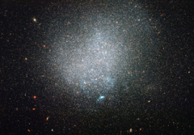

# Preview of potw1233a: "A lonely galactic island"
[https://www.spacetelescope.org/images/potw1233a/](https://www.spacetelescope.org/images/potw1233a/)

In  terms of intergalactic real estate, our Solar System has a plumb  location as part of a big, spiral galaxy, the Milky Way. Numerous, less  glamorous dwarf galaxies, keep the Milky Way company. Many galaxies,  however, are comparatively isolated, without close neighbours. One such  example is the small galaxy known as DDO 190, snapped here in a new  image from the NASA/ESA Hubble Space Telescope. DDO  190 is classified as a dwarf irregular galaxy as it is relatively small  and lacks clear structure. Older, reddish stars mostly populate DDO  190’s outskirts, while some younger, bluish stars gleam in DDO 190’s  more crowded interior. Some pockets of ionised gas heated up by stars  appear here and there, with the most noticeable one shining towards the  bottom of DDO 190 in this picture. Meanwhile, a great number of distant  galaxies with evident spiral, elliptical and less-defined shapes glow in  the background. DDO  190 lies around nine million light-years away from our Solar System. It  is considered part of the loosely associated Messier 94 group of  galaxies, not far from the Local Group of galaxies that includes the  Milky Way. Canadian astronomer Sidney van der Bergh was the first to  record DDO 190 in 1959 as part of the DDO catalogue of dwarf galaxies.  (“DDO” stands for the David Dunlap Observatory, now managed by the Royal  Astronomical Society of Canada, where the catalogue was created). Although  within the Messier 94 group, DDO 190 is on its own. The galaxy’s  nearest dwarf galaxy neighbour, DDO 187, is thought to be no closer than  three million light-years away. In contrast, many of the Milky Way’s  companion galaxies, such as the Large and Small Magellanic Clouds,  reside within a fifth or so of that distance, and even the giant spiral  of the Andromeda Galaxy is closer to the Milky Way than DDO 190 is to  its nearest neighbour. Hubble’s  Advanced Camera for Surveys captured this image in visible and infrared  light. The field of view is around 3.3 by 3.3 arcminutes A version of this image was entered into the Hubble’s Hidden Treasures Image Processing Competition by contestant Claude Cornen. Hidden Treasures is an initiative to invite astronomy enthusiasts to search the Hubble archive for stunning images that have never been seen by the general public. The competition has now closed and the results will be published soon.