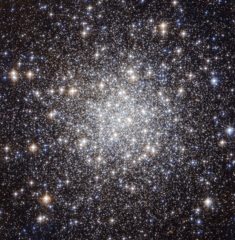

# Preview of potw1234a: "A collection of ancient stars"
[https://www.spacetelescope.org/images/potw1234a/](https://www.spacetelescope.org/images/potw1234a/)

The  NASA/ESA Hubble Space Telescope has produced this beautiful image of  the globular cluster Messier 56 (also known as M 56 or NGC 6779), which  is located about 33 000 light years away from the Earth in the  constellation of Lyra (The Lyre). The cluster is composed of a large  number of stars, tightly bound to each other by gravity. However,  this was not known when Charles Messier first observed it in January  1779.  He described Messier 56 as “a nebula without stars”, like most  globular clusters that he discovered — his telescope was not powerful  enough to individually resolve any of the stars visible here, making it  look like a fuzzy ball through his telescope’s eyepiece. We clearly see  from Hubble’s image how the development of technology over the years has  helped our understanding of astronomical objects. Astronomers  typically infer important properties of globular clusters by looking at  the light of their constituent stars. But they have to be very careful  when they observe objects like Messier 56, which is located close to the  Galactic plane. This region is crowded by “field-stars”, in other  words, stars in the Milky Way that happen to lie in the same direction  but do not belong to the cluster. These objects can contaminate the  light, and hence undermine the conclusions reached by astronomers.   A  tool often used by scientists for studying stellar clusters is the  colour-magnitude (or Hertzsprung-Russell) diagram. This chart compares  the brightness and colour of stars – which in turn, tells scientists  what the surface temperature of a star is. By  comparing high quality observations taken with the Hubble Space  Telescope with results from the standard theory of stellar evolution,  astronomers can characterise the properties of a cluster. In the case of  Messier 56, this includes its age, which at 13 billion years is  approximately three times the age of the Sun. Furthermore, they have  also been able to study the chemical composition of Messier 56. The  cluster has relatively few elements heavier than hydrogen and helium,  typically a sign of stars that were born early in the Universe’s  history, before many of the elements in existence today were formed in  significant quantities. Astronomers  have found that the majority of clusters with this type of chemical  makeup lie along a plane in the Milky Way’s halo. This suggests that  such clusters were captured from a satellite galaxy, rather than being  the oldest members of the Milky Way's globular cluster system as had  been previously thought. This  image consists of visible and near-infrared exposures from Hubble’s  Advanced Camera for Surveys. The field of view is approximately 3.3 by  3.3 arcminutes. A version of this image was entered into the Hubble’s Hidden Treasures Image Processing Competition by  contestant Gilles Chapdelaine. Hidden Treasures is an initiative to invite  astronomy enthusiasts to search the Hubble archive for stunning images  that have never been seen by the general public. The competition has now  closed and the results will be published soon.