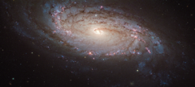

# Preview of potw1235a: "Spotting a supernova in NGC 5806"
[https://www.spacetelescope.org/images/potw1235a/](https://www.spacetelescope.org/images/potw1235a/)

A  new image from the NASA/ESA Hubble Space Telescope shows NGC 5806, a  spiral galaxy in the constellation Virgo (the Virgin). It lies around 80  million light years from Earth. Also visible in this image is a  supernova explosion called SN 2004dg. The  exposures that are combined into this image were carried out in early  2005 in order to help pinpoint the location of the supernova, which  exploded in 2004. The afterglow from this outburst of light, caused by a  giant star exploding at the end of its life, can be seen as a faint  yellowish dot near the bottom of the galaxy. NGC  5806 was chosen to be one of a number of galaxies in a study into  supernovae because Hubble’s archive already contained high resolution  imagery of the galaxy, collected before the star had exploded. Since  supernovae are both relatively rare, and impossible to predict with any  accuracy, the existence of such before-and-after images is precious for  astronomers who study these violent events. Aside  from the supernova, NGC 5806 is a relatively unremarkable galaxy: it is  neither particularly large or small, nor especially close or distant. The  galaxy’s bulge (the densest part in the centre of the spiral arms) is a  so-called disk-type bulge, in which the spiral structure extends right  to the centre of the galaxy, instead of there being a large elliptical  bulge of stars present. It is also home to an active galaxy nucleus, a  supermassive black hole which is pulling in large amounts of matter from  its immediate surroundings. As the matter spirals around the black  hole, it heats up and emits powerful radiation. This  image is produced from three exposures in visible and infrared light,  observed by Hubble’s Advanced Camera for Surveys. The field of view is  approximately 3.3 by 1.7 arcminutes. A version of this image was entered into the Hubble’s Hidden Treasures Image Processing Competition by contestant Andre van der Hoeven (who won second prize in the  competition for his image of Messier 77). Hidden Treasures is an  initiative to invite astronomy enthusiasts to search the Hubble archive  for stunning images that have never been seen by the general public. The  competition has now closed.