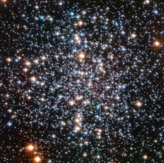

# Preview of potw1236a: "Globular Star Cluster M4"
[https://esahubble.org/images/potw1236a/](https://esahubble.org/images/potw1236a/)

A Hubble Space Telescope image of the globular star cluster, Messier 4. The cluster is a dense collection of several hundred thousand stars. Astronomers suspect that an intermediate-mass black hole, weighing as much as 800 times the mass of our Sun, is lurking, unseen, at its core. [Image description: Thousands of bright points of light on a black background fill the field of view. They appear somewhat more concentrated near the centre of the image. They have a variety of colours, with the most prominent stars appearing blue or yellow-orange. The brighter stars also display four diffraction spikes.]