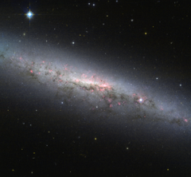

# Preview of potw1237a: "NGC 7090 — An actively star-forming galaxy"
[https://www.spacetelescope.org/images/potw1237a/](https://www.spacetelescope.org/images/potw1237a/)

This image portrays a beautiful view of the galaxy NGC 7090, as seen by the NASA/ESA Hubble Space Telescope. The galaxy is viewed edge-on from the Earth, meaning we cannot easily see the spiral arms, which are full of young, hot stars. However, our side-on view shows the galaxy’s disc and the bulging central core, where typically a large group of cool old stars are packed in a compact, spheroidal region. In addition, there are two interesting features present in the image that are worth mentioning. First, we are able to distinguish an intricate pattern of pinkish red regions over the whole galaxy. This indicates the presence of clouds of hydrogen gas. These structures trace the location of ongoing star formation, visual confirmation of recent studies that classify NGC 7090 as an actively star-forming galaxy. Second, we observe dust lanes, depicted as dark regions inside the disc of the galaxy. In NGC 7090, these regions are mostly located in lower half of the galaxy, showing an intricate filamentary structure. Looking from the outside in through the whole disc, the light emitted from the bright centre of the galaxy is absorbed by the dust, silhouetting the dusty regions against the bright light in the background. Dust in our galaxy, the Milky Way, has been one of the worst enemies of observational astronomers for decades. But this does not mean that these regions are quite blind spots in the sky. At near-infrared wavelengths — slightly longer wavelengths than visible light — this dust is largely transparent and astronomers are able to study what is really behind it. At still longer wavelengths, the realm of radio astronomy, the dust itself can actually be observed, letting astronomers study the structure and properties of dust clouds and their relationship with star formation. Lying in the southern constellation of Indus (The Indian), NGC 7090 is located about thirty million light-years from the Sun. Astronomer John Herschel first observed this galaxy on 4 October, 1834. The image was taken using the Wide Field Channel of the Advanced Camera for Surveys aboard the Hubble Space Telescope and combines orange light (coloured blue here), infrared (coloured red) and emissions from glowing hydrogen gas (also in red). A version of this image of NGC 7090 was entered into the Hubble’s Hidden Treasures Image Processing Competition by contestant Rasid Tugral. Hidden Treasures is an initiative to invite astronomy enthusiasts to search the Hubble archive for stunning images that have never been seen by the general public. The competition is now closed and the list of winners is available here.