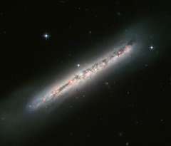

# Preview of potw1238a: "Glowing gas and dark dust in a side-on spiral"
[https://www.spacetelescope.org/images/potw1238a/](https://www.spacetelescope.org/images/potw1238a/)

The NASA/ESA Hubble Space Telescope has produced a sharp image of NGC 4634, a spiral galaxy seen exactly side-on. Its disc is slightly warped by ongoing interactions with a nearby galaxy, and it is crisscrossed by clearly defined dust lanes and bright nebulae. NGC 4634, which lies around 70 million light-years from Earth in the constellation of Coma Berenices, is one of a pair of interacting galaxies. Its neighbour, NGC 4633, lies just outside the upper right corner of the frame, and is visible in wide-field views of the galaxy. While it may be out of sight, it is not out of mind: its subtle effects on NGC 4634 are easy to see to a well-trained eye. Gravitational interactions pull the neat spiral forms of galaxies out of shape as they get closer to each other, and the disruption to gas clouds triggers vigorous episodes of star formation. While this galaxy’s spiral pattern is not directly visible thanks to our side-on perspective, its disc is slightly warped, and there is clear evidence of star formation. Along the full length of the galaxy, and scattered around parts of its halo, are bright pink nebulae. Similar to the Orion Nebula in the Milky Way, these are clouds of gas that are gradually coalescing into stars. The powerful radiation from the stars excites the gas and makes it light up, much like a fluorescent sign. The large number of these star formation regions is a telltale sign of gravitational interaction. The dark filamentary structures that are scattered along the length of the galaxy are caused by cold interstellar dust blocking some of the starlight. Hubble’s image is a combination of exposures in visible light produced by Hubble’s Advanced Camera for Surveys and the Wide Field and Planetary Camera 2.