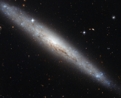

# Preview of potw1239a: "Hubble portrays a dusty spiral galaxy"
[https://www.spacetelescope.org/images/potw1239a/](https://www.spacetelescope.org/images/potw1239a/)

The NASA/ESA Hubble Space Telescope has provided us with another outstanding image of a nearby galaxy. This week, we highlight the galaxy NGC 4183, seen here with a beautiful backdrop of distant galaxies and nearby stars. Located about 55 million light-years from the Sun and spanning about eighty thousand light-years, NGC 4183 is a little smaller than the Milky Way. This galaxy, which belongs to the Ursa Major Group, lies in the northern constellation of Canes Venatici (The Hunting Dogs). NGC 4183 is a spiral galaxy with a faint core and an open spiral structure. Unfortunately, this galaxy is viewed edge-on from the Earth, and we cannot fully appreciate its spiral arms. But we can admire its galactic disc. The discs of galaxies are mainly composed of gas, dust and stars. There is evidence of dust over the galactic plane, visible as dark intricate filaments that block the visible light from the core of the galaxy. In addition, recent studies suggest that this galaxy may have a bar structure. Galactic bars are thought to act as a mechanism that channels gas from the spiral arms to the centre, enhancing star formation, which is typically more pronounced in the spiral arms than in the bulge of the galaxy. British astronomer William Herschel first observed NGC 4183 on 14 January 1778. This picture was created from visible and infrared images taken with the Wide Field Channel of the Advanced Camera for Surveys. The field of view is approximately 3.4 arcminutes wide. This image uses data identified by Luca Limatola in the Hubble's Hidden Treasures image processing competition.