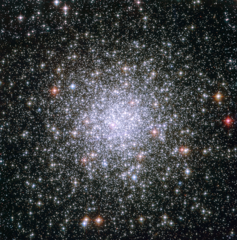

# Preview of potw1240a: "Cosmic riches"
[https://www.spacetelescope.org/images/potw1240a/](https://www.spacetelescope.org/images/potw1240a/)

This dazzling image shows the globular cluster Messier 69, or M 69 for short, as viewed through the NASA/ESA Hubble Space Telescope. Globular clusters are dense collections of old stars. In this picture, foreground stars look big and golden when set against the backdrop of the thousands of white, silvery stars that make up M 69. Another aspect of M 69 lends itself to the bejewelled metaphor: As globular clusters go, M 69 is one of the most metal-rich on record. In astronomy, the term “metal” has a specialised meaning: it refers to any element heavier than the two most common elements in our Universe, hydrogen and helium. The nuclear fusion that powers stars created all of the metallic elements in nature, from the calcium in our bones to the carbon in diamonds. Successive generations of stars have built up the metallic abundances we see today. Because the stars in globular clusters are ancient, their metallic abundances are much lower than more recently formed stars, such as the Sun. Studying the makeup of stars in globular clusters like M 69 has helped astronomers trace back the evolution of the cosmos. M 69 is located 29 700 light-years away in the constellation Sagittarius (the Archer). The famed French comet hunter Charles Messier added M 69 to his catalogue in 1780. It is also known as NGC 6637. The image is a combination of exposures taken in visible and near-infrared light by Hubble’s Advanced Camera for Surveys, and covers a field of view of approximately 3.4 by 3.4 arcminutes.