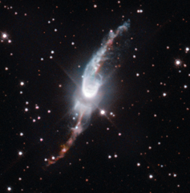

# Preview of potw1241a: "A cosmic garden sprinkler"
[https://www.spacetelescope.org/images/potw1241a/](https://www.spacetelescope.org/images/potw1241a/)

The  Universe is filled with mysterious objects. Many of them are as strange  as they are beautiful. Among these, planetary nebulae are probably one  of the most fascinating objects to behold in the night sky. No other  type of object has such a large variety of shapes and structures. The  NASA/ESA Hubble Space Telescope provides us this week with a striking  image of Hen 3-1475, a planetary nebula in the making. Planetary  nebulae — the name arises because most of these objects resembled a  planet when they were first discovered through early telescopes — are  expanding, glowing shells of gas coming from Sun-like stars at the ends  of their lives. They glow brightly because of the radiation that comes  from a hot, compact core, which remains after the outer envelope is  ejected, and is powerful enough to make these gossamer shells shine. Each  planetary nebula is complex and unique. Hen 3-1475 is a great example  of a planetary nebula in the making, a phase which is known to  astronomers as a protoplanetary or preplanetary nebula. Since  the central star has not yet blown away its complete shell, the star is  not hot enough to ionise the shell of gas and so the nebula does not  shine. Rather, we see the expelled gas thanks to light reflected off it.  When the star’s envelope is fully ejected, it will begin to glow and  become a planetary nebula. Hen  3-1475 is located in the constellation of Sagittarius around 18 000  light-years away from us. The central star is more than 12 000 times as  luminous as our Sun. Its most characteristic feature is a thick torus of  dust around the central star and two S-shaped jets that are emerging  from the pole regions of the central star. These jets are long outflows  of fast-moving gas travelling at hundreds of kilometres per second. The  formation of these bipolar jets has puzzled astronomers for a long  time. How can a spherical star form these complex structures? Recent  studies suggest that the object’s characteristic shape and the large  velocity outflow is created by a central source that ejects streams of  gas in opposite directions and precesses once every thousand years. It  is like an enormous, slowly rotating garden sprinkler in the middle of  the sky. No wonder astronomers also have nicknamed this object the  “Garden-sprinkler Nebula”. This  picture was taken with Hubble’s Wide Field Camera 3, which provides  significantly higher resolution than previous observations made with the  Wide Field and Planetary Camera 2 (heic0308). Links  Hubblecast 52: The Death of Stars explains how Sun-like stars end their lives as planetary nebulae 