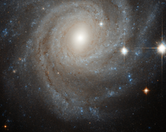

# Preview of potw1242a: "Galaxy in a spin"
[https://www.spacetelescope.org/images/potw1242a/](https://www.spacetelescope.org/images/potw1242a/)

NGC 3344 is a glorious spiral galaxy around half the size of the Milky Way, which lies 25 million light-years distant. We are fortunate enough to see NGC 3344 face-on, allowing us to study its structure in detail. The galaxy features an outer ring swirling around an inner ring with a subtle bar structure in the centre. The central regions of the galaxy are predominately populated by young stars, with the galactic fringes also featuring areas of active star formation. Central bars are found in around two thirds of spiral galaxies. NGC 3344’s is clearly visible here, although it is not as dramatic as some (see for example heic1202). The high density of stars in galaxies’ central regions gives them enough gravitational influence to affect the movement of other stars in their galaxy. However, NGC 3344’s outer stars are moving in an unusual manner, although the presence of the bar cannot entirely account for this, leaving astronomers puzzled. It is possible that in its past NGC 3344 passed close by another galaxy and accreted stars from it, but more research is needed to state this with confidence. The image is a combination of exposures taken in visible and near-infrared light, using Hubble’s Advanced Camera for Surveys. The field of view is around 3.4 by 3.4 arcminutes, or around a tenth of the diameter of the full Moon.