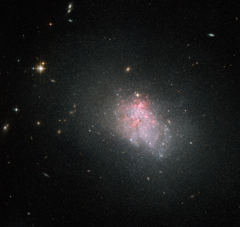

# Preview of potw1243a: "Violent star formation episodes in dwarf galaxies"
[https://www.spacetelescope.org/images/potw1243a/](https://www.spacetelescope.org/images/potw1243a/)

The NASA/ESA Hubble Space Telescope has imaged the faint irregular galaxy NGC 3738, a starburst galaxy. The galaxy is in the midst of a violent episode of star formation, during which it is converting reservoirs of hydrogen gas harboured in the galaxy’s centre into stars. Hubble spots this gas glowing red around NGC 3738, one of the most distinctive signs of ongoing star formation. Lying in the constellation of Ursa Major (The Great Bear), NGC 3738 is located about 12 million light-years from the Sun, and belongs to the Messier 81 group of galaxies. This galaxy — first observed by astronomer William Herschel  back in 1789 — is a nearby example of a blue compact dwarf, the faintest type of starburst galaxy. Blue compact dwarfs are small compared to large spiral galaxies — NGC 3738 is around 10 000 light-years across, just one tenth of the size of the Milky Way. This type of galaxy is blue in appearance by virtue of containing large clusters of hot, massive stars, which ionise the surrounding interstellar gas with their intense ultraviolet radiation. They are relatively faint and appear to be irregular in shape. Unlike spirals or elliptical galaxies, irregular galaxies do not have any distinctive features, such as a nuclear bulge or spiral arms. Rather, they are extremely chaotic in appearance. These galaxies are thought to resemble some of the earliest that formed in the Universe and may provide clues as to how stars appeared shortly after the Big Bang.  This image was created by combining visual and infrared images taken with the Wide Field Channel of the Advanced Camera for Surveys aboard the Hubble Space Telescope. The field of view of the Wide Field Channel is approximately 3.4 by 3.4 arcminutes wide.