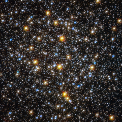

# Preview of potw1244a: "An unexpected population of young-looking stars"
[https://www.spacetelescope.org/images/potw1244a/](https://www.spacetelescope.org/images/potw1244a/)

The  NASA/ESA Hubble Space Telescope offers an impressive view of the centre  of globular cluster NGC 6362. The image of this spherical collection of  stars takes a deeper look at the core of the globular cluster, which  contains a high concentration of stars with different colours. Tightly  bound by gravity, globular clusters are composed of old stars, which,  at around 10 billion years old, are much older than the Sun. These  clusters are fairly common, with more than 150 currently known in our  galaxy, the Milky Way, and more which have been spotted in other  galaxies. Globular  clusters are among the oldest structures in the Universe that are  accessible to direct observational investigation, making them living  fossils from the early years of the cosmos. Astronomers  infer important properties of globular clusters by looking at the light  from their constituent stars. For many years, they were regarded as  ideal laboratories for testing the standard stellar evolution theory.  Among other things, this theory suggests that most of the stars within a  globular cluster should be of a similar age. Recently,  however, high precision measurements performed in numerous globular  clusters, primarily with the Hubble Space Telescope, has led some to  question this widely accepted theory. In particular, certain stars  appear younger and bluer than their companions, and they have been  dubbed blue stragglers. NGC 6362 contains many of these stars. Since  they are usually found in the core regions of clusters, where the  concentration of stars is large, the most likely explanation for this  unexpected population of objects seems to be that they could be either  the result of stellar collisions or transfer of material between stars  in binary systems. This influx of new material would heat up the star  and make it appear younger than its neighbours. NGC  6362 is located about 25 000 light-years from Earth in the  constellation of Ara (The Altar). British astronomer James Dunlop first  observed this globular cluster on 30 June 1826. This  image was created combining ultraviolet, visual and infrared images  taken with the Wide Field Channel of the Advanced Camera for Surveys and  the Wide Field Camera 3. An image image of NGC 6362 taken by the  MPG/ESO 2.2-metre telescope will be published by the European Southern  Observatory on Wednesday. See it on www.eso.org from 12:00 on 31 October.