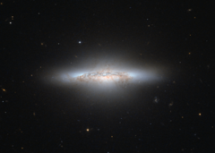

# Preview of potw1245a: "A galaxy colourfully waning"
[https://www.spacetelescope.org/images/potw1245a/](https://www.spacetelescope.org/images/potw1245a/)

The NASA/ESA Hubble Space Telescope has captured a beautiful galaxy that, with its reddish and yellow central area, looks rather like an explosion from a Hollywood movie. The galaxy, called NGC 5010, is in a period of transition. The aging galaxy is moving on from life as a spiral galaxy, like our Milky Way, to an older, less defined type called an elliptical galaxy. In this in-between phase, astronomers refer to NGC 5010 as a lenticular galaxy, which has features of both spirals and ellipticals. NGC 5010 is located around 140 million light-years away in the constellation of Virgo (The Virgin). The galaxy is oriented sideways to us, allowing Hubble to peer into it and show the dark, dusty, remnant bands of spiral arms. NGC 5010 has notably started to develop a big bulge in its disc as it takes on a more rounded shape. Most of the stars in NGC 5010 are red and elderly. The galaxy no longer contains all that many of the fast-lived blue stars common in younger galaxies that still actively produce new populations of stars. Much of the dusty and gaseous fuel needed to create fresh stars has already been used up in NGC 5010. Overt time, the galaxy will grow progressively more "red and dead”, as astronomers describe elliptical galaxies. Hubble's Advanced Camera for Surveys (ACS) snapped this image in violet and infrared light.