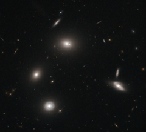

# Preview of potw1246a: "Galactic fireflies"
[https://www.spacetelescope.org/images/potw1246a/](https://www.spacetelescope.org/images/potw1246a/)

Luminous galaxies glow like fireflies on a dark night in this image snapped by the NASA/ESA Hubble Space Telescope. The central galaxy in this image is a gigantic elliptical galaxy designated 4C 73.08. A prominent spiral galaxy seen from "above" shines in the lower part of the image, while examples of galaxies viewed edge-on also populate the cosmic landscape. In the optical and near-infrared light captured to make this image, 4C 73.08 does not appear all that beastly. But when viewed in longer wavelengths the galaxy takes on a very different appearance. Dust-piercing radio waves reveal plumes emanating from the core, where a supermassive black hole spews out twin jets of material. 4C 73.08 is classified as a radio galaxy as a result of this characteristic activity in the radio part of the electromagnetic spectrum. Astronomers must study objects such as 4C 73.08 in multiple wavelengths in order to learn their true natures, just as seeing a firefly’s glow would tell a scientist only so much about the insect. Observing 4C 73.08 in visible light with Hubble illuminates galactic structure as well as the ages of constituent stars, and therefore the age of the galaxy itself. 4C 73.08 is decidedly redder than the prominent, bluer spiral galaxy in this image. The elliptical galaxy’s redness comes from the presence of many older, crimson stars, which shows that 4C 73.08 is older than its spiral neighbour. The image was taken using Hubble’s Wide Field Camera 3 through two filters: one which captures green light, and one which captures red and near-infrared light.