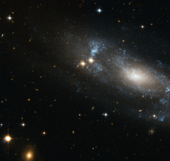

# Preview of potw1247a: "A loose spiral galaxy"
[https://www.spacetelescope.org/images/potw1247a/](https://www.spacetelescope.org/images/potw1247a/)

The NASA/ESA Hubble Space Telescope has spotted the spiral galaxy ESO 499-G37, seen here against a backdrop of distant galaxies, scattered with nearby stars. The galaxy is viewed from an angle, allowing Hubble to  reveal its spiral nature clearly. The faint, loose spiral arms can be distinguished as bluish features swirling around the galaxy’s nucleus. This blue tinge emanates from the hot, young stars located in the spiral arms. The arms of a spiral galaxy have large amounts of gas and dust, and are often areas where new stars are constantly forming. The galaxy’s most characteristic feature is a bright elongated nucleus. The bulging central core usually contains the highest density of stars in the galaxy, where typically a large group of comparatively cool old stars are packed in this compact, spheroidal region. One feature common to many spiral galaxies is the presence of a bar running across the centre of the galaxy. These bars are thought to act as a mechanism that channels gas from the spiral arms to the centre, enhancing the star formation. Recent studies suggest that ESO 499-G37’s nucleus sits within a small bar up to a few hundreds of light-years along, about a tenth the size of a typical galactic bar. Astronomers think that such small bars could be important in the formation of galactic bulges since they might provide a mechanism for bringing material from the outer regions down to the inner ones. However, the connection between bars and bulge formation is still not clear since bars are not a universal feature in spiral galaxies. Lying in the constellation of Hydra, ESO 499-G37 is located about 59 million light-years away from the Sun. The galaxy belongs to the NGC 3175 group. ESO 499-G37 was first observed in the late seventies within the ESO/Uppsala Survey of the ESO (B) atlas. This was a joint project undertaken by the European Southern Observatory (ESO) and the Uppsala Observatory, which used the ESO 1-metre Schmidt telescope at La Silla Observatory, Chile, to map a large portion of the southern sky looking for stars, galaxies, clusters, and planetary nebulae. This picture was created from visible and infrared exposures taken with the Wide Field Channel of the Advanced Camera for Surveys. The field of view is approximately 3.4 arcminutes wide.