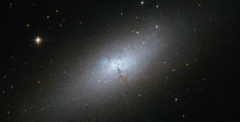

# Preview of potw1248a: "A peculiar compact blue dwarf galaxy"
[https://www.spacetelescope.org/images/potw1248a/](https://www.spacetelescope.org/images/potw1248a/)

The NASA/ESA Hubble Space Telescope provides us this week with an impressive image of the irregular galaxy NGC 5253. NGC 5253 is one of the nearest of the known Blue Compact Dwarf (BCD) galaxies, and is located at a distance of about 12 million light-years from Earth in the southern constellation of Centaurus. The most characteristic signature of these galaxies is that they harbour very active star-formation regions. This is in spite of their low dust content and comparative lack of elements heavier than hydrogen and helium, which are usually the basic ingredients for star formation. These galaxies contain molecular clouds that are quite similar to the pristine clouds that formed the first stars in the early Universe, which were devoid of dust and heavier elements. Hence, astronomers consider the BCD galaxies to be an ideal testbed for better understanding the primordial star-forming process. NGC 5253 does contain some dust and heavier elements, but significantly less than the Milky Way galaxy. Its central regions are dominated by an intense star forming region that is embedded in an elliptical main body, which appears red in Hubble’s image. The central starburst zone consists of a rich environment of hot, young stars concentrated in star clusters, which glow in blue in the image. Traces of the starburst itself can be seen as a faint and diffuse glow produced by the ionised oxygen gas. The true nature of BCD galaxies has puzzled astronomers for a long time. Numerical simulations following the current leading cosmological theory of galaxy formation, known as the Lambda Cold Dark Matter model, predict that there should be far more satellite dwarf galaxies orbiting big galaxies like the Milky Way. Astronomers refer to this discrepancy as the Dwarf Galaxy Problem. This galaxy is considered part of the Centaurus A/Messier 83 group of galaxies, which includes the famous radio galaxy Centaurus A and the spiral galaxy Messier 83. Astronomers have pointed out the possibility that the peculiar nature of NGC 5253 could result from a close encounter with Messier 83, its closer neighbour. This image was taken with the Hubble’s Advanced Camera for Surveys, combining visible and infrared exposures. The field of view in this image is approximately 3.4 by 3.4 arcminutes. A version of this image was entered into the Hubble’s Hidden Treasures image processing competition by contestant Nikolaus Sulzenauer.