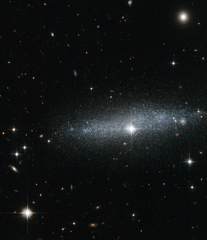

# Preview of potw1249a: "Glitter galaxy — An edge-on view of the ESO 318-13 galaxy"
[https://www.spacetelescope.org/images/potw1249a/](https://www.spacetelescope.org/images/potw1249a/)

The  brilliant cascade of stars through the middle of this image is the  galaxy ESO 318-13 as seen by the NASA/ESA Hubble Space Telescope.  Despite being located millions of light-years from Earth, the stars  captured in this image are so bright and clear you could almost attempt  to count them. Although  ESO 318-13  is the main event in this image, it is sandwiched between a  vast collection of bright celestial objects. Several stars near and far  dazzle in comparison to the neat dusting contained within the galaxy.  One that particularly stands out is located near the centre of the  image, and looks like an extremely bright star located within the  galaxy. This is, however, a trick of perspective. The star is located in  the Milky Way, our own galaxy, and it shines so brightly because it is  so much closer to us than ESO 318-13. There  are also a number of  tiny glowing discs scattered throughout the frame  that are more distant galaxies. In the top right corner, an elliptical  galaxy can be clearly seen, a galaxy which is much larger but more  distant than ESO 318-13. More interestingly, peeking through the ESO  318-13, near the right-hand edge of the image, is a distant spiral  galaxy. Galaxies  are largely made up of empty space; the stars within them only take up a  small volume, and providing a galaxy is not too dusty, it can be  largely transparent to light coming from the background. This makes  overlapping galaxies like these quite common. One particularly dramatic  example of this phenomenon is the galaxy pair NGC 3314 (heic1208). 