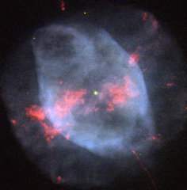

# Preview of potw1250a: "Smoky shells"
[https://www.spacetelescope.org/images/potw1250a/](https://www.spacetelescope.org/images/potw1250a/)

Located in a relatively vacant region of space about 4200 light-years away and difficult to see using an amateur telescope, the lonesome planetary nebula NGC 7354 is often overlooked. However, thanks to this image captured by the NASA/ESA Hubble Space Telescope we are able to see this brilliant ball of smoky light in spectacular detail. Just as shooting stars are not actually stars and lava lamps do not actually contain lava, planetary nebulae have nothing to do with planets. The name was coined by Sir William Herschel because when he first viewed a planetary nebula through a telescope, he could only identify a hazy smoky sphere, similar to gaseous planets such as Uranus. The name has stuck even though modern telescopes make it obvious that these objects are not planets at all, but the glowing gassy outer layers thrown off by a hot dying star. It is believed that winds from the central star play an important role in determining the shape and morphology of planetary nebulae. The structure of NGC 7354 is relatively easy to distinguish. It consists of a circular outer shell, an elliptical inner shell, a collection of bright knots roughly concentrated in the middle and two symmetrical jets shooting out from either side. Research suggests that these features could be due to a companion central star, however the presence of a second star in NGC 7354 is yet to be confirmed. NGC 7354 resides in Cepheus, a constellation named after the mythical King Cepheus of Aethiopia and is about half a light-year in diameter. A version of this image was entered into the Hubble’s Hidden Treasures image processing competition by contestant Bruno Conti.