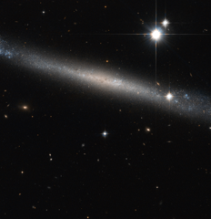

# Preview of potw1251a: "The Needle Galaxy"
[https://www.spacetelescope.org/images/potw1251a/](https://www.spacetelescope.org/images/potw1251a/)

Like finding a silver needle in the haystack of space, the NASA/ESA Hubble Space Telescope has produced this beautiful image of the spiral galaxy IC 2233, one of the flattest galaxies known. Typical spiral galaxies like the Milky Way are usually made up of three principal visible components: the disc where the spiral arms and most of the gas and dust is concentrated; the halo, a rough and sparse sphere around the disc that contains little gas, dust or star formation; and the central bulge at the heart of the disc, which is formed by a large concentration of ancient stars surrounding the Galactic Centre. However, IC 2233 is far from being typical. This object is a prime example of a super-thin galaxy, where the galaxy’s diameter is at least ten times larger than the thickness. These galaxies consist of a simple disc of stars when seen edge on. This orientation makes them fascinating to study, giving another perspective on spiral galaxies. An important characteristic of this type of objects is that they have a low brightness and almost all of them have no bulge at all. The bluish colour that can be seen along the disc gives evidence of the spiral nature of the galaxy, indicating the presence of hot, luminous, young stars, born out of clouds of interstellar gas. In addition, unlike typical spirals, IC 2233 shows no well-defined dust lane. Only a few small patchy regions can be identified in the inner regions both above and below the galaxy’s mid-plane. Lying in the constellation of Lynx, IC 2233 is located about 40 million light-years away from Earth. This galaxy was discovered by British astronomer Isaac Roberts in 1894. This image was taken with the Hubble’s Advanced Camera for Surveys, combining visible and infrared exposures. The field of view in this image is approximately 3.4 by 3.4 arcminutes. A version of this image was entered into the Hubble's Hidden Treasures image processing competition by contestant Luca Limatola.