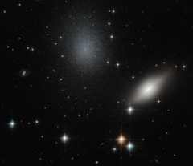

# Preview of potw1253a: "Don’t trust your eyes"
[https://www.spacetelescope.org/images/potw1253a/](https://www.spacetelescope.org/images/potw1253a/)

The Universe loves to fool our eyes, giving the impression that celestial objects are located at the same distance from Earth. A good example can be seen in this spectacular image produced by the NASA/ESA Hubble Space Telescope. The galaxies NGC 5011B and NGC 5011C are imaged against a starry background. Located in the constellation of Centaurus, the nature of these galaxies has puzzled astronomers. NGC 5011B (on the right) is a spiral galaxy belonging to the Centaurus Cluster of galaxies lying 156 million light-years away from the Earth. Long considered part of the faraway cluster of galaxies as well, NGC 5011C (the bluish galaxy at the centre of the image) is a peculiar object, with the faintness typical of a nearby dwarf galaxy, alongside the size of an early-type spiral. Astronomers were curious about the appearance of NGC 5011C. If the two galaxies were at roughly the same distance from Earth, they would expect the pair to show signs of interactions between them. However, there was no visual sign of interaction between the two. How could this be possible? To solve this problem, astronomers studied the velocity at which these galaxies are receding from the Milky Way and found that NGC 5011C is moving away far more slowly than its apparent neighbour, and its motion is more consistent with that of the nearby Centaurus A group at a distance of 13 million light-years. Thus, NGC 5011C, with only about ten million times the mass of the Sun in its stars, must indeed be a nearby dwarf galaxy rather than member of the distant Centaurus Cluster as was believed for many years. Problem solved. This image was taken with Hubble’s Advanced Camera for Surveys using visual and infrared filters.