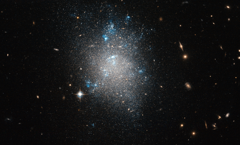

# Preview of potw1301a: "An archetypal dwarf galaxy"
[https://www.spacetelescope.org/images/potw1301a/](https://www.spacetelescope.org/images/potw1301a/)

The  constellation of Ursa Major (The Great Bear) is home to Messier 101,  the Pinwheel Galaxy. One of the biggest and brightest spiral galaxies in  the night sky, Messier 101 is also the subject of one of Hubble's most  famous images (heic0602). Like the Milky Way, Messier 101 is not alone, with smaller dwarf galaxies in its neighbourhood. NGC  5477, one of these dwarf galaxies in the Messier 101 group, is the  subject of this image from the NASA/ESA Hubble Space Telescope. Without  obvious structure, but with visible signs of ongoing starbirth, NGC 5477  looks much like an archetypal dwarf irregular galaxy. The bright  nebulae that extend across much of the galaxy are clouds of glowing  hydrogen gas in which new stars are forming. These glow pinkish red in  real life, although the selection of green and infrared filters through  which this image was taken makes them appear almost white. The  observations were taken as part of a project to measure accurate  distances to a range of galaxies within about 30 million light-years  from Earth, by studying the brightness of red giant stars. In  addition to NGC 5477, the image includes numerous galaxies in the  background, including some that are visible right through NGC 5477. This  serves as a reminder that galaxies, far from being solid, opaque  objects, are actually largely made up of the empty space between their  stars. This  image is a combination of exposures taken through green and infrared  filters using Hubble's Advanced Camera for Surveys. The field of view is  approximately 3.3 by 3.3 arcminutes. 