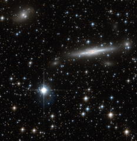

# Preview of potw1302a: "A busy patch of the Great Attractor"
[https://www.spacetelescope.org/images/potw1302a/](https://www.spacetelescope.org/images/potw1302a/)

A  busy patch of space has been captured in this image from the NASA/ESA  Hubble Space Telescope. Scattered with many nearby stars, the field also  has numerous galaxies in the background. Located  on the border of Triangulum Australe (The Southern Triangle) and Norma  (The Carpenter’s Square), this field covers part of the Norma Cluster  (Abell 3627) as well as a dense area of our own galaxy, the Milky Way. The  Norma Cluster is the closest massive galaxy cluster to the Milky Way,  and lies about 220 million light-years away. The enormous mass  concentrated here, and the consequent gravitational attraction, mean  that this region of space is known to astronomers as the Great  Attractor, and it dominates our region of the Universe. The  largest galaxy visible in this image is ESO 137-002, a spiral galaxy  seen edge on. In this image from Hubble, we see large regions of dust  across the galaxy’s bulge. What we do not see here is the tail of glowing X-rays that has been observed extending out of the galaxy — but which is invisible to an optical telescope like Hubble. Observing  the Great Attractor is difficult at optical wavelengths. The plane of  the Milky Way — responsible for the numerous bright stars in this image —  both outshines (with stars) and obscures (with dust) many of the  objects behind it. There are some tricks for seeing through this —  infrared or radio observations, for instance — but the region behind the  centre of the Milky Way, where the dust is thickest, remains an almost  complete mystery to astronomers. This image consists of exposures in blue and infrared light taken by Hubble’s Advanced Camera for Surveys.