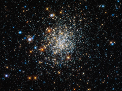

# Preview of potw1303a: "Appearances can be deceptive"
[https://www.spacetelescope.org/images/potw1303a/](https://www.spacetelescope.org/images/potw1303a/)

Globular  clusters are roughly spherical collections of extremely old stars, and  around 150 of them are scattered around our galaxy. Hubble is one of the  best telescopes for studying these, as its extremely high resolution  lets astronomers see individual stars, even in the crowded core. The  clusters all look very similar, and in Hubble’s images it can be quite  hard to tell them apart – and they all look much like NGC 411, pictured  here. And  yet appearances can be deceptive: NGC 411 is in fact not a globular  cluster, and its stars are not old. It isn’t even in the Milky Way. NGC  411 is classified as an open cluster. Less tightly bound than a  globular cluster, the stars in open clusters tend to drift apart over  time as they age, whereas globulars have survived for well over 10  billion years of galactic history. NGC 411 is a relative youngster — not  much more than a tenth of this age. Far from being a relic of the early  years of the Universe, the stars in NGC 411 are in fact a fraction of  the age of the Sun. The  stars in NGC 411 are all roughly the same age, having formed in one go  from one cloud of gas. But they are not all the same size. Hubble’s  image shows a wide range of colours and brightnesses in the cluster’s  stars. These tell astronomers many facts about the stars, including  their mass, temperature and evolutionary phase. Blue stars, for  instance, have higher surface temperatures than red ones. The  image is a composite produced from ultraviolet, visible and infrared  observations made by Hubble’s Wide Field Camera 3. This filter set lets  the telescope “see” colours slightly further beyond red and the violet  ends of the spectrum.