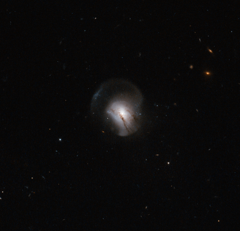

# Preview of potw1304a: "The moment the lights went out"
[https://www.spacetelescope.org/images/potw1304a/](https://www.spacetelescope.org/images/potw1304a/)

The  further away you look, the further back in time you see. Astronomers  use this fact to study the evolution of the Universe by looking at  nearby and more distant galaxies and comparing their features. Hubble is  particularly well suited for this type of work because of its extremely  high resolution and its position above the atmosphere. This has allowed  it to detect many of the most distant galaxies known, as well as making  detailed images of faraway objects. Comparing  galaxies in the distant past with those around us today, astronomers  have noticed that the nearby galaxies are far quieter and calmer than  their distant brethren, seen earlier in their lives. Nearby galaxies  (although not the Milky Way) are often large, elliptical galaxies with  little or no ongoing star formation, and their stars tend to be elderly  and red in colour. These galaxies, in astronomers' language, are "red  and dead". This is not so for galaxies further away, which typically show more vigorous star birth. The  reason for this appears to be that as the Universe has aged, galaxies  have often collided and merged together, and these events disrupt gas  clouds within them. A merger will usually be a trigger for such intense  star formation that the supply of gas is used up, and no more star  formation occurs afterwards. The merged elliptical galaxy then creeps  into old age, getting redder as its stars get older. This is expected to  happen to the Milky Way when it merges with the nearby Andromeda  Galaxy, some four billion years from now. The  galaxy in this image, catalogued as 2MASX J09442693+0429569, marks a  transitional phase in this process as young, star-forming galaxies  settle to become massive, red and dead galaxies. The  galaxy has tail-like features extending from it, typical of a galaxy  that has recently undergone a merger. Studying the properties of the  light from this galaxy, astronomers see no sign of ongoing star  formation; in other words, the merger triggered an event which has used  up all the gas. However, the observations suggest that star formation  was strong until the very recent past, and has ceased only within the  last billion years. This image therefore shows a snapshot of the moment  star formation stopped forever in a galaxy.  A version of this image was entered into the Hidden Treasures image processing competition by contestant Nick Rose.