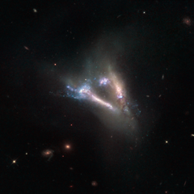

# Preview of potw1306a: "Cosmic “flying V” of merging galaxies"
[https://www.spacetelescope.org/images/potw1306a/](https://www.spacetelescope.org/images/potw1306a/)

This  large “flying V” is actually two distinct objects — a pair of  interacting galaxies known as IC 2184. Both the galaxies are seen almost  edge-on in the large, faint northern constellation of Camelopardalis  (The Giraffe), and can be seen as bright streaks of light surrounded by  the ghostly shapes of their tidal tails. These  tidal tails are thin, elongated streams of gas, dust and stars that  extend away from a galaxy into space. They occur when galaxies  gravitationally interact with one another, and material is sheared from  the outer edges of each body and flung out into space in opposite  directions, forming two tails. They almost always appear curved, so when  they are seen to be relatively straight, as in this image, it is clear  that we are viewing the galaxies side-on. Also  visible in this image are bursts of bright blue, pinpointing hot  regions where the stars from both galaxies have begun to crash together  during the merger. The image consists of visible and infrared observations from Hubble’s Wide Field and Planetary Camera 2. A version of this picture was entered into the Hubble’s Hidden Treasures image-processing competition by contestant Serge Meunier.