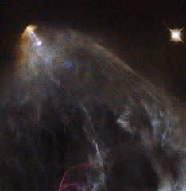

# Preview of potw1307a: "A glowing jet from a young star"
[https://www.spacetelescope.org/images/potw1307a/](https://www.spacetelescope.org/images/potw1307a/)

This image shows an object known as HH 151, a bright jet of glowing material trailed by an intricate, orange-hued plume of gas and dust. It is located some 460 light-years away in the constellation of Taurus (The Bull), near to the young, tumultuous star HL Tau. In the first few hundred thousand years of life, new stars like HL Tau pull in material that falls towards them from the surrounding space. This material forms a hot disc that swirls around the coalescing body, launching narrow streams of material from its poles. These jets are shot out at speeds of several hundred kilometres per second and collide violently with nearby clumps of dust and gas, creating wispy, billowing structures known as Herbig-Haro objects — like HH 151 seen in the image above. Such objects are very common in star-forming regions. They are short-lived, and their motion and evolution can actually be seen over very short timescales, on the order of years. They quickly race away from the newly-forming star that emitted them, colliding with new clumps of material and glowing brightly before fading away. A version of this image was entered into the Hidden Treasures image processing competition by Gilles Chapdelaine.