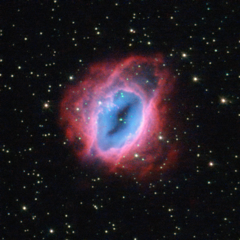

# Preview of potw1308a: "Glowing, fiery shells of gas"
[https://www.spacetelescope.org/images/potw1308a/](https://www.spacetelescope.org/images/potw1308a/)

It may look like something from The Lord of the Rings, but this fiery swirl  is actually a planetary nebula known as ESO 456-67. Set against a  backdrop of bright stars, the rust-coloured object lies in the  constellation of Sagittarius (The Archer), in the southern sky. Despite  the name, these ethereal objects have nothing at all to do with  planets; this misnomer came about over a century ago, when the first  astronomers to observe them only had small, poor-quality telescopes.  Through these, the nebulae looked small, compact, and planet-like — and  so were labelled as such. When  a star like the Sun approaches the end of its life, it flings material  out into space. Planetary nebulae are the intricate, glowing shells of  dust and gas pushed outwards from such a star. At their centres lie the  remnants of the original stars themselves — small, dense white dwarf  stars. In  this image of ESO 456-67, it is possible to see the various layers of  material expelled by the central star. Each appears in a different hue —  red, orange, yellow, and green-tinted bands  of gas are visible, with clear patches of space at the heart of the  nebula. It is not fully understood how planetary nebulae form such a  wide variety of shapes and structures; some appear to be spherical, some  elliptical, others shoot material in waves from their polar regions,  some look like hourglasses or figures of eight, and others resemble  large, messy stellar explosions — to name but a few. A version of this image was entered into the Hubble's Hidden Treasures image processing competition by contestant Jean-Christophe Lambry