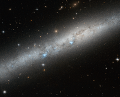

# Preview of potw1309a: "Blue bursts of hot young stars"
[https://www.spacetelescope.org/images/potw1309a/](https://www.spacetelescope.org/images/potw1309a/)

This  image, speckled with blue, white, and yellow light, shows part of the  spiral galaxy IC 5052. Surrounded by distant stars and galaxies, it  emits a bright blue-white glow which highlights its narrow, intricate  structure. It is viewed side-on in the constellation of Pavo (The  Peacock), in the southern sky. When  spiral galaxies are viewed from this angle, it is very difficult to  fully understand their properties and how they are arranged. IC 5052 is  actually a barred spiral galaxy – its pinwheeling arms do not begin from  the centre point but are instead attached to either end of a straight  "bar" of stars that cuts through the galaxy's middle. Approximately two  thirds of all spirals are barred, including the Milky Way. Bursts  of pale blue light are visible across the galaxy's length, partially  blocked out by weaving lanes of darker gas and dust. These are pockets  of extremely hot newborn stars. The bars present in spirals like IC 5052  are thought to help these formation processes by effectively funnelling  material from the swirling arms inwards towards these hot stellar  nurseries.  A version of this image was submitted to the Hubble's Hidden Treasures image processing competition by contestant Serge Meunier.