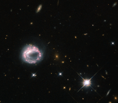

# Preview of potw1310a: "One ring to rule them all"
[https://www.spacetelescope.org/images/potw1310a/](https://www.spacetelescope.org/images/potw1310a/)

Galaxies  can take many forms — elliptical blobs, swirling spiral arms, bulges,  and discs are all known components of the wide range of galaxies we have  observed using telescopes like the NASA/ESA Hubble Space Telescope.  However, some of the more intriguing objects in the sky around us  include ring galaxies like the one pictured above — Zw II 28. Ring  galaxies are mysterious objects. They are thought to form when one  galaxy slices through the disc of another, larger, one — as galaxies are  mostly empty space, this collision is not as aggressive or as  destructive as one might imagine. The likelihood of two stars physically  colliding is minimal, and it is instead the gravitational effects of  the two galaxies that causes the disruption. This  disruption upsets the material in both galaxies, causing it to  redistribute to form a dense central core, encircled by bright stars.  All this commotion causes clouds of gas and dust to collapse and  triggers new periods of intense star formation in the outer ring, which  is thus full of hot, young, blue stars and regions that are actively  giving rise to new stars. The  sparkling pink and purple loop of Zw II 28 is not a typical ring  galaxy due to its lack of a visible central companion. For many years it  was thought to be a lone circle on the sky, but observations using  Hubble have shown that there may be a possible companion lurking just  inside the ring, where the loop appears to double back on itself. The  galaxy has a knotty, swirling ring structure, with some areas appearing  much brighter than others. A version of this image was entered into the Hubble’s Hidden Treasures image processing competition by contestant Judy Schmidt.