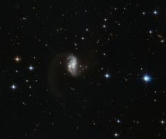

# Preview of potw1311a: "Galactic glow worm"
[https://www.spacetelescope.org/images/potw1311a/](https://www.spacetelescope.org/images/potw1311a/)

This  charming and bright galaxy, known as IRAS 23436+5257, was captured by  the the NASA/ESA Hubble Space Telescope. It is located in the northern  constellation of Cassiopeia, which is named after an arrogant, vain, and  yet beautiful mythical queen. The  twisted, wormlike structure of this galaxy is most likely the result of  a collision and subsequent merger of two galaxies. Such interactions  are quite common in the Universe, and they can range from minor  interactions involving a satellite galaxy being caught by a spiral arm,  to major galactic crashes. Friction between the gas and dust during a  collision can have a major effect on the galaxies involved, morphing the  shape of the original galaxies and creating interesting new structures. When  you look up at the calm and quiet night sky it is not always easy to  picture it as a dynamic and vibrant environment with entire galaxies in  motion, spinning like children’s toys and crashing into whatever crosses  their path. The motions are, of course, extremely slow, and occur over  millions or even billions of years. The  aftermath of these galactic collisions helps scientists to understand  how these movements occur and what may be in store for our own Milky Way, which is on a collision course with a neighbouring  galaxy, Messier 31. A version of this image was entered into the Hubble’s Hidden Treasures image processing competition by contestant Judy Schmidt. Hidden Treasures was an initiative to  invite astronomy enthusiasts to search the Hubble archive for stunning  images that have never been seen by the general public. The competition  has now closed and the results are published here.