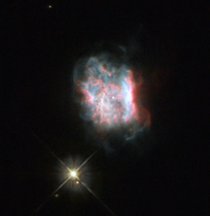

# Preview of potw1312a: "Masquerading as a double star"
[https://www.spacetelescope.org/images/potw1312a/](https://www.spacetelescope.org/images/potw1312a/)

The  object in this image is Jonckheere 900 or J 900, a planetary nebula —  glowing shells of ionised gas pushed out by a dying star. Discovered in  the early 1900s by astronomer Robert Jonckheere, the dusty nebula is  small but fairly bright, with a relatively evenly spread central region  surrounded by soft wispy edges. Despite  the clarity of this Hubble image, the two objects in the picture above  can be confusing for observers. J 900’s nearby companion, a faint star in  the constellation of Gemini, often causes problems for observers  because it is so close to the nebula — when seeing conditions are bad,  this star seems to merge into J 900, giving it an elongated appearance.  Hubble’s position above the Earth’s atmosphere means that this is not an  issue for the space telescope. Astronomers  have also mistakenly reported observations of a double star in place of  these two objects, as the planetary nebula is quite small and compact. J 900’s  central star is only just visible in this image, and is very faint —  fainter than the nebula’s neighbour. The nebula appears to display a  bipolar structure, where there are two distinct lobes of material  emanating from its centre, enclosed by a bright oval disc. A version of this image was entered into the Hubble’s Hidden Treasures image processing competition by contestant Josh Barrington.