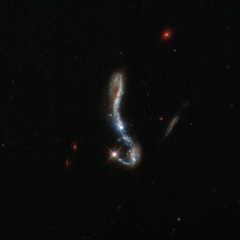

# Preview of potw1313a: "Light and dust in a nearby starburst galaxy"
[https://www.spacetelescope.org/images/potw1313a/](https://www.spacetelescope.org/images/potw1313a/)

Visible  as a small, sparkling hook in the dark sky, this beautiful object is  known as J082354.96+280621.6, or J082354.96 for short. It is a starburst  galaxy, so named because of the incredibly (and unusually) high rate of  star formation occurring within it. One  way in which astronomers probe the nature and structure of galaxies  like this is by observing the behaviour of their dust and gas  components; in particular, the Lyman-alpha emission.  This occurs when electrons within a hydrogen atom fall from a higher  energy level to a lower one, emitting light as they do so. This emission  is interesting because this light leaves its host galaxy only after  extensive scattering in the nearby gas — meaning that this light can be  used as a pretty direct probe of what a galaxy is made up of. The study of this Lyman-alpha emission is common in very distant galaxies, but now a study named LARS (Lyman Alpha Reference Sample) [1] is investigating the same effect in galaxies that are closer by.  Astronomers chose fourteen galaxies, including this one, and used  spectroscopy and imaging to see what was happening within them. They  found that these Lyman-alpha photons can travel much further if a galaxy  has less dust — meaning that we can use this emission to infer how dusty the source galaxy is. The  LARS study relies heavily on the high resolving power of Hubble. When  Hubble is decommissioned, no telescope will be able to make observations  like this in the far ultraviolet part of the spectrum — meaning that  small, glittering galaxies imaged and probed by studies like LARS may  give us some of the most detailed data we have to work with for some  time to come. Credit: ESA/Hubble & NASA, M. Hayes Notes [1] Hayes, Östlin et al., The Lyman Alpha Reference Sample: extended Lyman alpha halos produced at low dust content, The Astrophysical Journal, 2013.